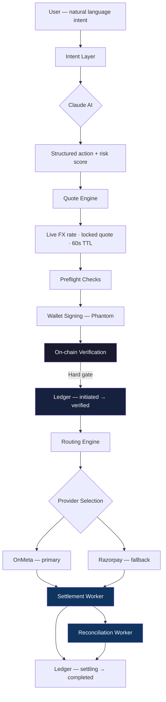
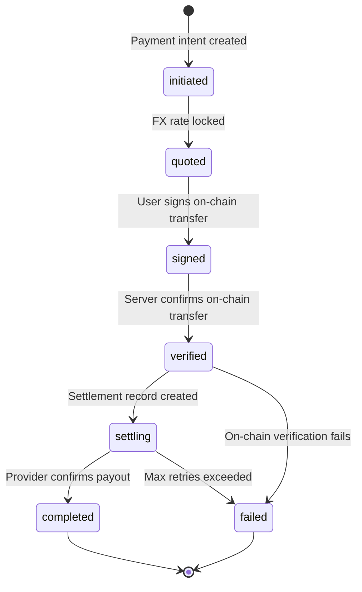

# Auron

**Programmable financial infrastructure. Currently settling on Solana.**

Auron is a coordination layer between payment intent and settlement execution. It handles FX quoting, on-chain verification, multi-provider routing, retry orchestration, and full audit trail persistence — the same primitives production fintech systems are built on, wired to a stablecoin settlement rail.

The blockchain is an implementation detail. The product is the infrastructure.

**[Live Demo](https://auron-mocha.vercel.app) · [Pay Link](https://auron-mocha.vercel.app/pay/demo?amount=500&note=Lunch) · [Solana Blink](https://auron-mocha.vercel.app/api/actions/pay?to=demo&amount=500&currency=INR)**

---

## What's Live Today

Every component below is in production code, not roadmap:

| Component | Status | What it does |
|---|---|---|
| Payment intent layer | ✅ Live | Natural language → structured payment action via Claude |
| FX quote engine | ✅ Live | Live CoinGecko rate, 0.85% spread, 60s locked quote |
| On-chain verification | ✅ Live | 7-step USDC transfer verification before settlement |
| Internal ledger | ✅ Live | Postgres-backed transaction + settlement + audit trail |
| Settlement state machine | ✅ Live | 7-state lifecycle with atomic transitions |
| Async settlement workers | ✅ Live | Queue-based execution with retry + reconciliation |
| Multi-provider routing | ✅ Live | OnMeta (primary) + Razorpay (fallback), scored routing engine |
| Anchor vault program | ✅ Devnet | Time-locked USDC custody, PDA-based, program-enforced |
| Solana Blinks | ✅ Live | Every pay link is a natively composable action |
| KYC system | ✅ Live | Middleware-gated, Supabase-tracked, provider-agnostic |
| 6-layer security | ✅ Live | Risk scoring, spend ceiling, urgency detection, closed signing |

---

## The Coordination Problem

India's UPI network processes ₹20 trillion per month across 350 million users. It is the most active real-time payment system on earth.

It has no programmable layer. No treasury primitives. No cross-border settlement logic. No lifecycle management above the transaction level.

Every attempt to build on top of it produces the same thing: a wrapper around a single rail that breaks at the coordination boundary.

The gap is not in the rails. It is in the layer that sits above them — the layer that manages state, routes between providers, tracks settlement, and recovers from failure. That layer does not exist today as open, composable infrastructure.

---

## Architecture



---

## Settlement Lifecycle

Every payment moves through a deterministic, persisted state machine. No payment proceeds without passing through each gate.



**Every transition is:**
- Atomic — both `transactions` and `status_history` update in the same operation
- Immutable — status history rows are never updated or deleted
- Recoverable — failed settlements re-enter the worker queue automatically

---

## Internal Ledger

Auron maintains a financial ledger independent of blockchain state — the same pattern Stripe, Razorpay, and Wise use to manage payment state across unreliable external systems.

**Three-table schema (PostgreSQL via Supabase):**

```
transactions     — single source of truth for every payment intent
settlements      — one row per attempt; carries provider payout ID and UTR
status_history   — append-only audit trail; every transition with timestamp + reason
```

Row-level security is enabled on all tables. All writes go through the service role key on server-side routes — the client never touches the ledger directly.

The ledger exists because blockchain finality is not the same as settlement finality. A confirmed Solana transaction does not mean a merchant received INR. The ledger tracks the full chain of custody from user intent to bank credit.

---

## On-Chain Verification

Settlement never executes on an unverified transaction. Verification is a synchronous hard gate, not a background check.

Before settlement, the server independently:

1. Fetches the parsed transaction from Solana RPC
2. Confirms `confirmed` or `finalized` commitment status
3. Rejects transactions with any error field set
4. Scans **all instructions including CPI inner instructions** — required because Phantom routes USDC transfers through the Associated Token Program, making the transfer invisible to top-level instruction inspection
5. Verifies USDC mint address against expected devnet/mainnet mint
6. Validates transfer amount within 1% tolerance (handles FX rounding)
7. Checks idempotency — already-settled signatures are rejected

If any check fails, the ledger is marked `failed` and the client receives a hard error. No settlement proceeds.

---

## Queue-Based Settlement Orchestration

Settlement execution is decoupled from the payment request. The API endpoint creates the ledger record and returns immediately. Workers handle execution.

**Two worker routes, scheduled via Vercel Cron:**

```
/api/workers/settlement  — claims pending settlements, executes payout calls, updates ledger
/api/workers/reconcile   — polls in-flight settlements against provider status, fixes discrepancies
```

**Claim pattern uses optimistic locking:**

```sql
UPDATE settlements
SET status = 'processing'
WHERE id = $settlementId
  AND status = 'pending'
  AND retry_count < 3
```

This prevents double-processing across concurrent invocations without requiring distributed locks or external coordination.

**Retry classification:**
- Retryable: timeouts, network failures → exponential backoff, re-queued
- Non-retryable: invalid UPI ID, KYC rejection → terminated immediately, no retry

**Reconciliation worker additionally handles:**
- Settlements stuck in `processing` beyond 10 minutes → reset to `pending`
- Provider-confirmed payouts not yet reflected in ledger → fixed automatically
- Critical mismatch (Auron says completed, provider says failed) → flagged for manual review

---

## Routing Engine

Provider selection is scored, not hardcoded. Adding a new settlement provider requires one row in a capability matrix.

```
Provider    Region    Fee      Speed     Status
────────────────────────────────────────────────
OnMeta      IN        0.5%     ~20s      Live
Razorpay    IN        0.99%    ~15s      Live
Transak     Global    1.5%     ~60s      Pending KYB
Stripe      US/EU     2.9%     next-day  Pending
Manual      Global    0%       ~1h       Always available
```

Scoring weights fee 60%, speed 40%. The routing engine selects the best available provider for each payment's region and amount. Fallback is automatic.

---

## Solana Anchor Program

Custom Anchor program providing time-locked USDC custody. Treasury logic is enforced at the program level — not database-enforced.

- **Program ID:** `B5DwqnCoDrY8ezfGaZfpAnvZ4FwCtPNHk6vT5nRgFENg` (devnet)
- **PDA:** `[b"vault", owner_pubkey]` — one vault per user, deterministic address
- **USDC custody:** held in an ATA owned by the PDA — no party can access funds until `clock::unix_timestamp >= unlock_timestamp`

```rust
pub fn lock_savings(ctx, amount: u64, unlock_timestamp: i64, label: String) -> Result<()>
pub fn unlock_savings(ctx) -> Result<()>
```

[View on Solscan (devnet)](https://solscan.io/account/B5DwqnCoDrY8ezfGaZfpAnvZ4FwCtPNHk6vT5nRgFENg?cluster=devnet)

---

## Solana Blinks

Full implementation of the [Solana Actions spec](https://docs.dialect.to/documentation/solana-actions). Every pay link is simultaneously a human-readable payment page and a composable action operable inside X/Twitter, Dialect, and Phantom without leaving the host surface.

```
GET  /api/actions/pay  →  action metadata + label
POST /api/actions/pay  →  serialized transaction for wallet signing
```

---

## Why Solana

Sub-second finality and near-zero fees make the on-chain leg of the payment flow invisible to users. A USDC transfer from user to treasury confirms in ~400ms at a cost of ~$0.00025 — fast enough that waiting for it is not a UX problem.

The composability story (Blinks, Actions) creates distribution channels that don't exist on slower chains. A pay link shared in a tweet becomes an executable payment without a redirect.

The architecture is designed for multi-rail expansion. Solana is the current settlement rail. It is not the product.

---

## Intent Layer

Users describe what they want in plain language. The system resolves it into a structured, verifiable action.

```
"send ₹500 to Priya"
→ { action: "upi_payment", inr_amount: 500, recipient: "priya@upi", usdc_amount: 5.97 }

"lock ₹2000 for 3 months"
→ { action: "lock_savings", usdc_amount: 23.88, duration_days: 90 }

"scan and pay"
→ QR scanner → UPI intent → full settlement flow
```

Powered by Claude Sonnet with prompt caching (90% cost reduction on repeated system prompt calls).

**Security gates before every execution:**

| Layer | What it does |
|---|---|
| Intent mirror | Explicit confirmation before any execution |
| Scam detector | Urgency keywords trigger mandatory 60s cooldown |
| Spend ceiling | Per-transaction limit, user-configurable |
| Risk scoring | New recipients, unusual amounts, velocity all scored 0–100 |
| Closed signing | Wallet signs only Auron-originated requests |
| Daily cap | Hard ceiling enforced server-side |

---

## Demo

**2-minute flow:**

1. Open [auron-mocha.vercel.app](https://auron-mocha.vercel.app)
2. Connect Phantom (devnet)
3. Type: *"send ₹500 to demo@upi"*
4. Confirm the quote — FX rate, USDC amount, and merchant locked
5. Approve in Phantom — USDC transfers to Auron treasury on-chain
6. Server verifies the transfer, creates settlement record
7. Payout routes to merchant UPI via Razorpay
8. Receipt with UTR number

**Or use a pay link directly:**
```
https://auron-mocha.vercel.app/pay/demo?amount=500&note=Lunch
```

**Or trigger via Blink (paste in X/Twitter or Dialect):**
```
https://auron-mocha.vercel.app/api/actions/pay?to=demo&amount=500&currency=INR
```

---

## Local Setup

```bash
cd frontend
npm install
cp .env.example .env.local
npm run dev
```

**Required environment variables:**
```
ANTHROPIC_API_KEY              — Claude intent parsing
NEXT_PUBLIC_SUPABASE_URL       — Supabase project URL
NEXT_PUBLIC_SUPABASE_ANON_KEY  — Supabase anon key
SUPABASE_SERVICE_ROLE_KEY      — Service role key (server-side only)
```

**Database (run `frontend/lib/db/schema.sql` in Supabase SQL Editor):**
Creates: `transactions`, `settlements`, `status_history`, `users`, `kyc_submissions`, `contacts`, `intent_log`

**Optional:**
```
ONMETA_API_KEY         — leave unset for demo mode (simulated payout)
RAZORPAY_KEY_ID        — Razorpay payout credentials
RAZORPAY_KEY_SECRET
SOLANA_RPC_URL         — defaults to public devnet RPC
DEMO_SETTLEMENT=true   — skip real payout, TX verification still runs
```

---

## Tech Stack

| Layer | Technology |
|---|---|
| Framework | Next.js 14 App Router, TypeScript |
| Intent Engine | Claude Sonnet — structured parsing, prompt caching |
| Settlement Rail | Solana — USDC SPL transfers, Anchor vault program |
| Ledger | Supabase PostgreSQL — transactions, settlements, audit trail |
| Auth | Supabase — Google OAuth + phone OTP |
| Wallet | Phantom — desktop + mobile deep link |
| Offramp (primary) | OnMeta — USDC → INR via UPI |
| Offramp (fallback) | Razorpay — UPI payouts |
| Rate Limiting | Vercel KV |
| Security | argon2id PIN, CSP headers, RLS on all DB tables |
| Distribution | Solana Blinks, shareable pay links, PWA |

---

## Roadmap

**Phase 1 — Settlement Infrastructure (current)**
- Programmable payment intent layer
- Internal ledger with full lifecycle management
- On-chain verification engine
- Queue-based settlement orchestration
- Time-locked treasury vault

**Phase 2 — Treasury Primitives**
- Merchant settlement APIs
- Programmable payment splits and escrow
- Agent-authorized recurring settlement
- Compliance and reconciliation tooling
- Expanded liquidity provider routing

**Phase 3 — Sovereign Financial Infrastructure**
- Multi-rail settlement (SWIFT, Stellar, Lightning)
- Institutional treasury APIs
- Intelligent liquidity routing across rails
- Cross-border settlement coordination
- Autonomous treasury orchestration agents

---

## Unit Economics (Live Mode)

At 10,000 transactions/day averaging ₹400:

| Source | Daily | Annual |
|---|---|---|
| FX spread (0.85%) | ₹34,000 | ₹12.4M |
| OnMeta fees (~0.5%) | −₹20,000 | −₹7.3M |
| **Net** | **₹14,000** | **₹5.1M (~$61K USD)** |

Jupiter swap fees (0.3%) add on top for USDC→SOL flows.

---

*Auron is a programmable financial system that currently settles on Solana.*
